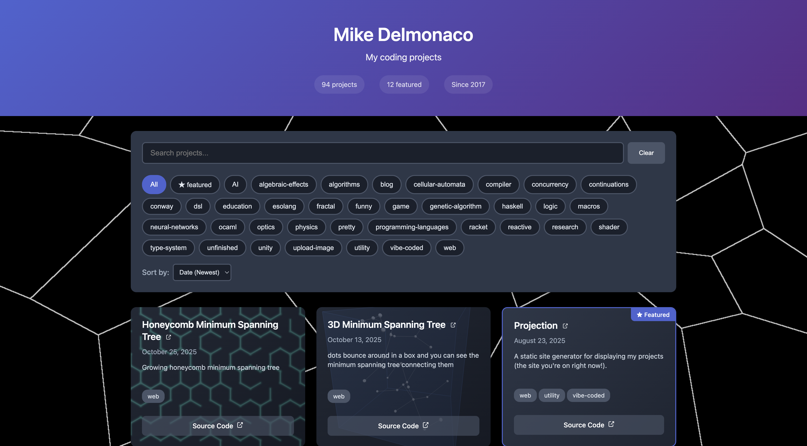

# Projection

A modern, reusable static site generator that creates beautiful, interactive galleries to showcase your coding projects. Generate your portfolio site with a single command.

Here is an example of a portfolio site using Projection: https://quasarbright.github.io/portfolio/

And its source code: https://github.com/quasarbright/portfolio



## ✨ Features

- **🖥️ Web Admin Interface** - Manage projects through an intuitive web UI with live preview
- **📦 Easy Installation** - Install globally from source
- **🚀 Quick Setup** - Initialize a new project in seconds
- **📱 Responsive Design** - Works on desktop, tablet, and mobile
- **🔍 Search & Filter** - Real-time search and tag-based filtering
- **⭐ Featured Projects** - Highlight your best work
- **🏷️ Flexible Tagging** - Organize projects with tags (ANY/ALL filtering)
- **🔥 Hot Reloading** - Development server with automatic rebuild and refresh
- **🎨 Customizable** - Override default styles and scripts
- **🚢 GitHub Pages Deployment** - Deploy with a single command (or through the admin UI)

## 📋 Table of Contents

- [Installation](#-installation)
- [Quick Start](#-quick-start)
- [Admin Interface](#-admin-interface)
- [Configuration](#-configuration)
- [Project Data Format](#-project-data-format)
- [Customization](#-customization)
- [Troubleshooting](#-troubleshooting)
- [Deployment](#-deployment)
- [Project Structure](#-project-structure)
- [Contributing](#-contributing)
- [License](#-license)
- [Links](#-links)

## 📦 Installation

### Requirements

- Node.js 14.0.0 or higher

### Install from npm

```bash
npm install -g @quasarbright/projection
```

### Install from Source

```bash
# Clone the repository
git clone https://github.com/quasarbright/projection.git
cd projection

# Install dependencies
npm install

# Build the project
npm run build

# Link globally (makes 'projection' command available)
npm link
```

Now you can use the `projection` command from anywhere on your system!

## 🚀 Quick Start

### 1. Initialize a New Project

```bash
# Create a new directory for your portfolio
mkdir my-portfolio
cd my-portfolio

# Initialize with sample files
projection init
```

This creates:
- `projects.yaml` - Sample project data
- `projection.config.json` - Configuration file with defaults
- `.gitignore` - Git ignore patterns
- `README.md` - Quick start guide

### 2. Edit Your Projects

**Option A: Use the Admin Interface (Recommended)**

```bash
projection admin
```

Opens a web-based editor at http://localhost:3000 where you can:
- Add, edit, and delete projects visually
- Upload project thumbnails
- See live preview of your portfolio
- Manage tags with autocomplete

**Option B: Edit Files Directly**

Edit `projects.yaml` to add your own projects:

```yaml
projects:
  - id: "my-awesome-project"
    title: "My Awesome Project"
    description: "A brief description of what this project does"
    creationDate: "2024-01-15"
    tags: ["web", "javascript"]
    pageLink: "https://example.com/my-project"
    sourceLink: "https://github.com/username/my-project"
    thumbnailLink: "./screenshots/project.png"
    featured: true
```

### 3. Start Development Server

```bash
projection dev
```

This will:
- Build your site
- Start a local server at http://localhost:8080
- Watch for changes and auto-reload
- Open your browser automatically

### 4. Build for Production

```bash
projection build
```

Your site will be generated in the `dist/` directory, ready for deployment.

## 🖥️ Admin Interface

Projection includes a powerful web-based admin interface that makes managing your portfolio easier than editing files directly.

### Starting the Admin Interface

```bash
projection admin
```

This opens a local web server at http://localhost:3000 with a full-featured admin UI.

### Features

**Visual Project Editor**
- Create, edit, and delete projects through an intuitive form interface
- Live preview of your portfolio as you make changes
- Real-time validation with helpful error messages

**Image Management**
- Upload project thumbnails directly through the UI
- Drag-and-drop image upload
- Automatic image optimization and storage

**Tag Management**
- Visual tag selector with autocomplete
- See tag usage counts across all projects
- Create new tags on the fly

**Live Preview**
- See your changes instantly in an embedded preview
- Click projects in the preview to edit them
- Test search and filtering in real-time

**Smart Editing**
- Form validation ensures data integrity
- Automatic ID generation from project titles
- Date picker for creation dates
- Toggle featured status with a checkbox

## ⚙️ Configuration

### Configuration File

Projection uses a `projection.config.json` file for site configuration. This file is separate from your project data and can be edited through the admin interface or manually.

Configuration is loaded in this order:

1. Command-line `--config` option
2. `projection.config.json` in current directory
3. Default configuration

### projection.config.json

JSON format configuration file:

```json
{
  "title": "My Projects",
  "description": "A showcase of my coding projects",
  "baseUrl": "./",
  "dynamicBackgrounds": [],
  "customStyles": null,
  "customScripts": null,
  "output": "dist"
}
```

### Configuration Options

| Option | Type | Default | Description |
|--------|------|---------|-------------|
| `title` | string | "My Projects" | Site title displayed in header |
| `description` | string | "A showcase of my coding projects" | Site description and meta description |
| `baseUrl` | string | "./" | Base URL for resolving relative paths |
| `dynamicBackgrounds` | string[] | [] | Array of background URLs (see [Dynamic Backgrounds](#-dynamic-backgrounds)) |
| `customStyles` | string | null | Path to custom styles directory |
| `customScripts` | string | null | Path to custom scripts directory |
| `output` | string | "dist" | Output directory path |

### Editing Configuration

**Option A: Admin Interface (Recommended)**

Use the Settings button in the admin interface to edit configuration through a user-friendly form with validation.

**Option B: Edit Manually**

Edit `projection.config.json` directly in your text editor.

### Path Resolution

The `baseUrl` is used to resolve relative paths in your project data:

- **Relative paths** (`./path`, `../path`, `filename`) → Resolved relative to `baseUrl`
- **Absolute paths** (`/path`) → Used as-is
- **Full URLs** (`https://...`) → Used as-is

**Example:**
```javascript
// Config
baseUrl: "https://username.github.io/"

// Project data
pageLink: "./my-project/"  // → https://username.github.io/my-project/
pageLink: "/absolute"      // → /absolute
pageLink: "https://..."    // → https://...
```

### 🎨 Dynamic Backgrounds

Projection supports dynamic backgrounds that add visual interest to your portfolio. These are web pages (like p5.js sketches, animations, or visualizations) that display behind your project cards.

#### What are Dynamic Backgrounds?

Dynamic backgrounds are full-screen web pages loaded in an iframe behind your portfolio content. Each time a visitor loads your site, one background is randomly selected from your list, creating a unique experience.

#### Managing Dynamic Backgrounds

**Option A: Admin Interface (Recommended)**

1. Open the admin interface: `projection admin`
2. Click the **Settings** button
3. Navigate to the **Dynamic Backgrounds** tab
4. Add background URLs with live preview
5. Test each background before saving

The admin interface provides:
- Live iframe previews of each background
- Visual status indicators (loaded/error)
- Click to expand and test backgrounds full-screen

**Option B: Edit Configuration Manually**

Add background URLs to your `projection.config.json`:

```json
{
  "title": "My Projects",
  "description": "My portfolio",
  "baseUrl": "./",
  "dynamicBackgrounds": [
    "https://example.com/background1",
    "https://example.com/background2",
    "https://example.com/background3"
  ]
}
```

#### Background Requirements

Your background pages should:

1. **Be full-screen** - Fill the entire viewport
2. **Work in an iframe** - Not blocked by X-Frame-Options
3. **Be performant** - Lightweight animations that don't slow down the site

#### Best Practices

1. **Test performance** - Ensure backgrounds don't slow down your site
2. **Keep it subtle** - Backgrounds should enhance, not distract from your projects
4. **Consider accessibility** - Avoid flashing or rapidly moving elements
5. **Mobile-friendly** - Test on mobile devices for performance

## 📊 Project Data Format

### Supported Formats

Projection automatically detects and reads project data from:
1. `projects.yaml` (recommended)
2. `projects.yml`
3. `projects.json`

### YAML Format (Recommended)

```yaml
projects:
  - id: "awesome-project"
    title: "Awesome Project"
    description: "This project does amazing things with modern web technologies"
    creationDate: "2024-01-15"
    tags: ["web", "javascript", "typescript"]
    pageLink: "./awesome-project/"
    sourceLink: "https://github.com/username/awesome-project"
    thumbnailLink: "./screenshots/awesome.png"
    featured: true
    
  - id: "another-project"
    title: "Another Project"
    description: "A different project with different features"
    creationDate: "2024-02-20"
    tags: ["python", "data-science"]
    pageLink: "https://example.com/another-project"
    thumbnailLink: "./screenshots/another.png"
```

### JSON Format

```json
{
  "projects": [
    {
      "id": "awesome-project",
      "title": "Awesome Project",
      "description": "This project does amazing things",
      "creationDate": "2024-01-15",
      "tags": ["web", "javascript"],
      "pageLink": "./awesome-project/",
      "sourceLink": "https://github.com/username/awesome-project",
      "thumbnailLink": "./screenshots/awesome.png",
      "featured": true
    }
  ]
}
```

### Project Fields

| Field | Type | Required | Description |
|-------|------|----------|-------------|
| `id` | string | ✅ Yes | Unique identifier (must be valid URL slug: lowercase, alphanumeric, hyphens only) |
| `title` | string | ✅ Yes | Display name of the project |
| `description` | string | ✅ Yes | Project description (truncated with ellipsis on cards) |
| `creationDate` | string | ✅ Yes | ISO date string (YYYY-MM-DD format) |
| `tags` | string[] | ✅ Yes | Array of tags for categorization and filtering |
| `pageLink` | string | ✅ Yes | Primary link to the project (page, demo, or live site) |
| `sourceLink` | string | ❌ No | Link to source code repository (shows "Source Code" button) |
| `thumbnailLink` | string | ❌ No | Path or URL to project screenshot (used as card background) |
| `featured` | boolean | ❌ No | Highlight the project with special styling (border and badge) |

### Field Validation Rules

#### Project ID (`id`)
- Must be unique across all projects
- Must be a valid URL slug:
  - Lowercase letters only
  - Can contain numbers and hyphens
  - Cannot start or end with a hyphen
  - Pattern: `/^[a-z0-9]+(?:-[a-z0-9]+)*$/`

**Valid IDs:**
```yaml
id: "my-project"
id: "project-123"
id: "awesome-web-app"
```

**Invalid IDs:**
```yaml
id: "My-Project"      # ❌ Contains uppercase
id: "-my-project"     # ❌ Starts with hyphen
id: "my_project"      # ❌ Contains underscore
id: "my project"      # ❌ Contains space
```

#### Creation Date (`creationDate`)
- Must be in ISO date format: `YYYY-MM-DD`
- Used for sorting projects by date

**Valid dates:**
```yaml
creationDate: "2024-01-15"
creationDate: "2023-12-31"
```

**Invalid dates:**
```yaml
creationDate: "01/15/2024"  # ❌ Wrong format
creationDate: "2024-1-5"    # ❌ Missing leading zeros
```

## 🎨 Customization

### Custom Styles

You can override the default styles by creating a `styles/` directory in your project:

```bash
mkdir styles
# Add your custom CSS files
```

**Directory structure:**
```
my-portfolio/
├── styles/
│   ├── main.css      # Override main styles
│   ├── cards.css     # Override card styles
│   └── custom.css    # Add your own styles
├── projects.yaml
└── projection.config.json
```

If the `styles/` directory exists, Projection will use your custom styles instead of the bundled defaults. You can copy the default styles and modify them:

**Default styles included:**
- `main.css` - Layout, theme, components, dark color scheme
- `cards.css` - Project card styling, 3D hover effects, background images
- `modal.css` - Modal styling (for future use)

### Custom Scripts

Similarly, you can override JavaScript functionality:

```bash
mkdir scripts
# Add your custom JavaScript files
```

**Default scripts included:**
- `search.js` - Real-time search functionality
- `filter.js` - Tag filtering and sorting
- `modal.js` - Modal functionality (for future use)
- `dynamic-background.js` - Dynamic background effects

### Custom Assets

Place additional assets in an `assets/` directory:

```bash
mkdir assets
# Add favicon, images, etc.
```

### Template Resolution

Projection uses this priority for templates:

1. **User custom files** in your project directory (`styles/`, `scripts/`, `assets/`)
2. **Bundled defaults** from the package

This allows you to:
- Use defaults out of the box
- Override specific files as needed
- Mix custom and default files

## 🔧 Troubleshooting

### Build Fails with "Projects file not found"

**Problem:** Projection can't find your project data file.

**Solution:**
```bash
# Make sure you have one of these files:
ls projects.yaml  # or projects.yml or projects.json

# If not, initialize a new project:
projection init
```

### Invalid Project ID Error

**Problem:** Project ID doesn't match the required format.

**Solution:** Project IDs must be valid URL slugs:
```yaml
# ✅ Good
id: "my-awesome-project"
id: "project-123"

# ❌ Bad
id: "My Project"        # Use: "my-project"
id: "project_name"      # Use: "project-name"
id: "-my-project"       # Use: "my-project"
```

### Dev Server Port Already in Use

**Problem:** Port 8080 is already in use.

**Solution:**
```bash
# Use a different port
projection dev --port 3000
```

### Changes Not Reflecting in Browser

**Problem:** Browser shows old content after changes.

**Solution:**
1. Make sure dev server is running (`projection dev`)
2. Check console for rebuild messages
3. Hard refresh browser (Ctrl+Shift+R or Cmd+Shift+R)
4. Clear browser cache

### Missing Thumbnails

**Problem:** Project thumbnails not showing.

**Solution:**
1. Check that `thumbnailLink` paths are correct
2. Verify images exist at specified paths
3. Run `projection dev` and use inspect element to check the img src on the card. You may need to update `thumbnailLink` or `baseUrl`.

### Build Output Directory Not Created

**Problem:** `dist/` directory doesn't exist after build.

**Solution:**
```bash
# Check for build errors
projection build

# Try cleaning first
projection build --clean

# Check file permissions
ls -la
```

## 🚢 Deployment

The generated `dist/` directory contains everything needed for deployment.

### Deploying to GitHub Pages

Projection includes a built-in `deploy` command that makes deploying to GitHub Pages effortless. It automatically builds your site and publishes it to the `gh-pages` branch.

#### Quick Start

```bash
# Deploy your site in one command
projection deploy
```

That's it! Your site will be built and deployed to GitHub Pages automatically.

#### Prerequisites

Before deploying, make sure you have:

1. **Git installed** on your system
2. **A Git repository** initialized in your project:
   ```bash
   git init
   git add .
   git commit -m "Initial commit"
   ```
3. **A remote repository** configured (usually on GitHub):
   ```bash
   git remote add origin https://github.com/username/repository-name.git
   ```

#### Step-by-Step Deployment

**1. Configure your site for GitHub Pages**

Add a `baseUrl` to your `projection.config.json`:

```json
{
  "title": "My Portfolio",
  "description": "My awesome projects",
  "baseUrl": "/"
}
```

> **Note:** The `baseUrl` is important for GitHub Pages if you're linking to other repos' pages.

**2. Deploy your site**

```bash
projection deploy
```

This command will:
- ✅ Validate your Git setup
- ✅ Build your site with the correct base URL
- ✅ Create/update the `gh-pages` branch
- ✅ Push your site to GitHub
- ✅ Display your GitHub Pages URL

**3. Enable GitHub Pages (first time only)**

After your first deployment:

1. Go to your repository on GitHub
2. Click **Settings** → **Pages**
3. Under **Source**, select:
   - Branch: `gh-pages`
   - Folder: `/ (root)`
4. Click **Save**

Your site will be live at `https://username.github.io/repository-name/` within a few minutes!

#### Configuration Options

##### In projection.config.json

```json
{
  "baseUrl": "/repository-name/",
  "homepage": "portfolio.example.com",
  "deployBranch": "gh-pages"
}
```

**Configuration notes:**
- `baseUrl` - Required for GitHub Pages (use your repository name)
- `homepage` - Optional: Custom domain (creates CNAME file)
- `deployBranch` - Optional: Custom deployment branch (defaults to "gh-pages")

##### Command-Line Options

```bash
# Deploy to a custom branch
projection deploy --branch main

# Custom commit message
projection deploy --message "Update portfolio with new projects"

# Use a different Git remote
projection deploy --remote upstream

# Skip the build step (use existing dist/)
projection deploy --no-build

# Deploy from a custom directory
projection deploy --dir build

# Simulate deployment without pushing
projection deploy --dry-run

# Force push (overwrites remote history)
projection deploy --force
```

#### Examples for Different Repository Types

##### Example 1: Project Repository (most common)

**Repository:** `https://github.com/username/my-portfolio`

**Configuration:**
```json
{
  "title": "My Portfolio",
  "baseUrl": "/my-portfolio/"
}
```

**Deploy:**
```bash
projection deploy
```

**Result:** Site live at `https://username.github.io/my-portfolio/`

##### Example 2: Custom Domain

**Repository:** `https://github.com/username/portfolio`

**Configuration:**
```json
{
  "title": "My Portfolio",
  "baseUrl": "/",
  "homepage": "portfolio.example.com"
}
```

**Notes:**
- Use `baseUrl: "/"` for custom domains (root path)
- The `homepage` field creates a CNAME file for your custom domain

**Deploy:**
```bash
projection deploy
```

**DNS Setup (required for custom domains):**
1. Add a CNAME record pointing to `username.github.io`
2. Or add A records pointing to GitHub's IPs:
   - `185.199.108.153`
   - `185.199.109.153`
   - `185.199.110.153`
   - `185.199.111.153`

**Result:** Site live at `https://portfolio.example.com/`

#### Troubleshooting Deployment

##### "Git is not installed"

**Problem:** Git is not found on your system.

**Solution:**
```bash
# Install Git
# macOS (with Homebrew):
brew install git

# Windows: Download from https://git-scm.com/
# Linux (Ubuntu/Debian):
sudo apt-get install git
```

##### "Not a git repository"

**Problem:** Your project is not a Git repository.

**Solution:**
```bash
# Initialize Git repository
git init
git add .
git commit -m "Initial commit"
```

##### "No git remote found"

**Problem:** No remote repository is configured.

**Solution:**
```bash
# Add a remote (replace with your repository URL)
git remote add origin https://github.com/username/repository-name.git

# Verify remote was added
git remote -v
```

##### "Authentication failed"

**Problem:** Git cannot authenticate with GitHub.

**Solution:**

https://docs.github.com/en/authentication/keeping-your-account-and-data-secure/about-authentication-to-github#authenticating-with-the-command-line

##### "Site not updating after deployment"

**Problem:** GitHub Pages shows old content after deployment.

**Solution:**
1. **Wait a few minutes** - GitHub Pages can take 1-10 minutes to update
2. **Check GitHub Actions** - Go to your repository → Actions tab to see build status
3. **Hard refresh browser** - Press Ctrl+Shift+R (or Cmd+Shift+R on Mac)
4. **Verify gh-pages branch** - Check that the branch has your latest changes
5. **Check GitHub Pages settings** - Ensure it's configured to use the `gh-pages` branch

##### "404 errors for assets (CSS, images)"

**Problem:** Your site loads but CSS and images are broken.

**Solution:** Check your `baseUrl` configuration:

- Make sure it has a trailing slash
- inspect the project's card, find the `img` for the thumbnail, and look at its `src` attribute. Make sure it is correct. You may need to adjust `baseurl`.

##### "Custom domain not working"

**Problem:** Custom domain shows 404 or doesn't resolve.

**Solution:**

1. **Verify CNAME file exists:**
   ```bash
   # Check gh-pages branch for CNAME file
   git checkout gh-pages
   cat CNAME  # Should contain your domain
   git checkout main
   ```

2. **Check DNS configuration:**
   - CNAME record should point to `username.github.io`
   - DNS changes can take up to 48 hours to propagate
   - Use `dig portfolio.example.com` to verify DNS

3. **Configure in GitHub:**
   - Go to Settings → Pages
   - Enter your custom domain
   - Enable "Enforce HTTPS" (after DNS propagates)

4. **Update your config:**
   ```json
   {
     baseUrl: "/",
     homepage: "portfolio.example.com",
   };
   ```

##### "Build fails during deployment"

**Problem:** The build step fails before deployment.

**Solution:**
```bash
# Test build locally first
projection build

# Check for errors in your projects.yaml
# Common issues:
# - Invalid project IDs
# - Missing required fields
# - Invalid date formats

# If build works locally, try:
projection deploy --clean
```

## 📁 Project Structure

```
my-portfolio/
├── projects.yaml              # Your project data
├── projection.config.json     # Configuration (optional)
├── styles/                    # Custom styles (optional)
│   ├── main.css
│   └── custom.css
├── scripts/                   # Custom scripts (optional)
│   └── custom.js
├── assets/                    # Static assets (optional)
│   └── favicon.ico
├── screenshots/               # Project thumbnails
│   ├── project1.png
│   └── project2.png
└── dist/                      # Generated site (created by build)
    ├── index.html
    ├── styles/
    ├── scripts/
    └── assets/
```

## 🤝 Contributing

Contributions are welcome! Here's how you can help:

1. **Report bugs** - Open an issue with details and reproduction steps
2. **Suggest features** - Share your ideas for improvements
3. **Submit pull requests** - Fix bugs or add features

### Development Setup

```bash
# Clone the repository
git clone https://github.com/quasarbright/projection.git
cd projection

# Install dependencies
npm install

# Build the project
npm run build

# Run tests
npm test

# Make projection command accessible
npm link
```

Creating a test portfolio

```bash
cd ../
mkdir projection-test
cd projection-test
projection init
projection admin
```

### Running Tests

```bash
# Run all tests
npm test

# Run tests in watch mode
npm run test:watch

# Run specific test file
npm test -- config.test.ts
```

## 📄 License

MIT License - see [LICENSE](LICENSE) file for details.

## 🔗 Links

- **GitHub Repository:** https://github.com/quasarbright/projection
- **Live Demo:** https://quasarbright.github.io/portfolio/
- **Author:** [Mike Delmonaco](https://github.com/quasarbright)
- **Issues:** https://github.com/quasarbright/projection/issues

---

**Need help?** Open an issue on GitHub or check the [troubleshooting section](#-troubleshooting).
